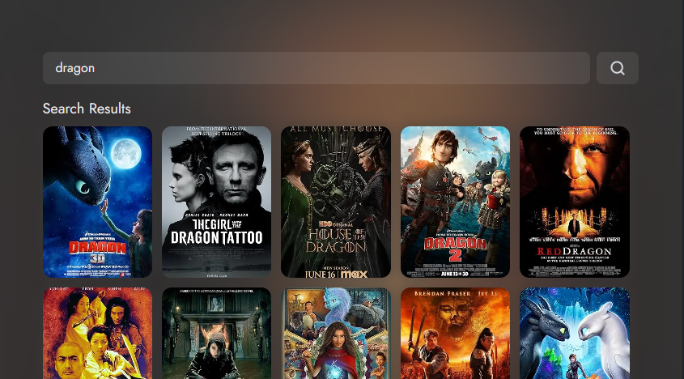

# Filmy Diary.

Keep a fun movie diary and easily share your watch list with friends and family!.

**live demo: [https://filmy-diary.netlify.app/](https://filmy-diary.netlify.app/)**

---

### Made with ❤️ by [Akash Yadav](https://www.instagram.com/akashxolotl)

Like my works and want to support me?

<a href="https://www.buymeacoffee.com/akashyadav777" target="_blank"></a>

---

## Project Description

Your personal movie diary – a simple way to track what you've seen and share it with the people you love.

```shell
npm install
```

and after that start the dev server.

```shell
npm run dev
```

## Tools Used

1. Favicon: [React Icons](https://react-icons.github.io/react-icons/)
1. Movie API: [OMDB](https://www.omdbapi.com/)
1. Database: [Supabase](https://supabase.com/)
1. Code Editor: [VS Code](https://code.visualstudio.com/)

## License

[MIT](https://choosealicense.com/licenses/mit/)

Happy Coding! 🚀